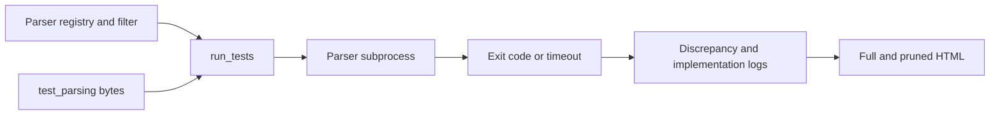

# Initial project assessment

Assessment date: **2026-10-02**. Local baseline:
`1ef36fa01286573e846ac449e8683f8833c5b26a` (merge of upstream PR #139).
The public GitHub API reported the same SHA for upstream `master` during this
assessment. The initial working tree was clean and `origin` pointed to
`https://github.com/Prodigysec/JSONTestSuite.git`; no `upstream` remote was configured.

This first phase establishes documentation, architecture, and a review queue.
It does not integrate the pending PRs or change parser/runner behavior. The
upstream inventory below is an initial triage of open item titles and bodies,
with selected local-code checks, not a completed review of every discussion,
patch, or closed item. Refresh it before implementation.

## What is here

| Component | Baseline | Role |
| --- | --- | --- |
| `test_parsing/` | 318 files: 95 `y_`, 188 `n_`, 35 `i_` | Byte-level acceptance/rejection inputs. |
| `test_transform/` | 22 files | Inputs exposing differences in parsed values or serialization. |
| `programs` in `run_tests.py` | 94 distinct entries (95 definitions, one repeated key) | Commands for specific parsers, versions, and modes. |
| `parsers/` | Mixed source, wrappers, build projects, and binaries | Connects parser APIs to a process exit-code protocol. |
| `results/` | Logs, two parsing reports, transformation report, CSS, image | Historical output plus the default destination for new runs. |
| `article/parsing_json.md` | Original article source | Context and historical interpretation of results. |

The corpus is independently useful to downstream parser projects. The runner
and adapter collection are a separate portability and reproducibility problem:
some commands assume old interpreter versions, fixed installation paths, or
macOS binaries. Ninety-four configurations do not mean ninety-four distinct
libraries or ninety-four runnable installations on a given host.

## Execution and reporting architecture

1. CLI parsing accepts an optional fixture selector and a JSON filter file.
2. `run_tests()` opens `results/logs.txt` in overwrite mode, sorts parser names,
   filters them, and optionally runs each entry's setup command.
3. It walks `test_parsing/` for `.json` files. A selector matches the basename of
   a corpus file; it does not substitute an external input file.
4. It starts a subprocess for each parser/fixture pair, passing a filename or
   supplying bytes on stdin. Parser output is discarded and execution is
   limited to five seconds. Execution is sequential.
5. Exit status is compared with the filename prefix. Only unexpected `y_`/`n_`
   results, all `i_` outcomes, crashes, and timeouts are logged.
6. Report functions read all `.txt` files in `results/`, group cases by their
   logged outcomes, and write full and pruned HTML reports. A missing outcome
   is rendered as an expected result when another parser logged that case.

There is no current transformation runner, aggregate CI verdict, runtime version
inventory, or repository-wide build/installation system. Adapter subprojects
can contain their own tests and build scripts.

## Findings from the local code

These findings describe the initial baseline. See
[implementation progress](#implementation-progress) for subsequent fixes.

| Priority | Finding and evidence | Consequence / next action |
| --- | --- | --- |
| High | `run_tests()` uses `result == "FAIL"` in the exit-1 branch. | This comparison leaves `result` as `None`. Later checks happen to classify ordinary rejection correctly, but the internal result is wrong. Fix with regression coverage. |
| High | The timeout handler prints `result` before the assignment later in the loop. | A timeout on the first executed case can raise `UnboundLocalError`; later timeouts can print a previous result. Fix and exercise a first-case timeout. |
| High | Successful `y_`/`n_` cases and explicit skips are absent from logs. | Reports cannot establish complete execution; absent cells can conflate expected and unexecuted cases. Track explicit outcomes and planned/executed/skipped totals; relates to #131. |
| High | Setup uses `subprocess.call()` without checking its return code; parser stderr is discarded. | Build and dependency failures can look like parser behavior. Separate setup failure, unavailable adapters, JSON rejection, crash, and timeout. |
| High | `parsers/test_json.rb` treats a successfully parsed `nil` as rejection. | Valid top-level JSON `null` is rejected by the wrapper. Review PR #145 and test on an available Ruby runtime. |
| Medium | Empty filters are falsey and mean all parsers; unknown names or fixture selectors are not validated. | Typos can silently run nothing, while `[]` runs everything. Define and test explicit selection semantics. |
| Medium | Reports ingest every `.txt` file in their output directory. | Old or unrelated data can be combined with a new run. Isolate each run and define an explicit report input. |
| Medium | `f_underline_non_printable_bytes()` inserts printable fixture characters into HTML without escaping them. | Displayed input can be interpreted as markup. Escape fixture text and parser labels while preserving intentional report formatting. |
| Medium | The runner does not return an aggregate failure code for discrepancies. | CI cannot use process success as a test verdict. Define a documented exit policy. |
| Medium | Executable paths and version labels are hard-coded; many binaries/toolchains are historical. | Add reproducible builds, availability checks, actual version metadata, and platform-aware configuration. |
| Low | The registry defines `C++ nlohmann JSON 20190718` twice. | Python retains only the latter dictionary entry. Remove the duplicate and detect repeated registry names in future validation. |
| Medium | `test_transform/` is not executed by `run_tests.py`. | Numeric precision, duplicate keys, and value preservation need a separate result contract and runner. |

Byte-for-byte comparison found two duplicate pairs in the root parsing corpus:

- `y_number_minus_zero.json` and `y_number_negative_zero.json` (PR #126).
- `n_structure_U+2060_word_joined.json` and
  `n_structure_whitespace_U+2060_word_joiner.json`.

Do not remove these automatically: downstream projects may refer to the names,
and historical results also use filenames as identifiers. The nested CCAN test
copies mentioned in issues #92 and #94 need a separate audit.

## Standards and coverage decisions

Use [RFC 8259](https://www.rfc-editor.org/rfc/rfc8259.html) as the primary reference.
Important distinctions for future changes are:

- Section 2 defines a single JSON text and its permitted surrounding whitespace.
  A stream of multiple texts is a separate input mode.
- Sections 6 and 9 permit implementation limits, including numeric range and
  precision. Syntactic validity and exact value preservation are distinct.
- Section 7 defines legal escapes and unescaped characters; escaping does not
  permit arbitrary backslash sequences.
- Section 8 discusses encoding and Unicode interoperability. Malformed-byte
  fixtures are intentional data, not files to repair by transcoding.
- Section 9 permits extensions. Acceptance of an `n_` fixture can identify an
  enabled extension; record that mode when interpreting results.

The fork should retain compatibility with the existing corpus while developing
explicit metadata for syntax, limits, modes, and transformations. Any changed
classification needs a documented rationale and an impact review.

## Upstream review queue

The [open issues](https://github.com/nst/JSONTestSuite/issues) and
[open PRs](https://github.com/nst/JSONTestSuite/pulls) were checked through the
public GitHub API: **39 issues and 14 PRs**. All PRs listed below remain pending
local diff review and integration. Suggested review order is based on scope and
dependencies, not an assertion that a proposal is ready to merge.

### Open pull requests

| PR | Proposed change | Initial review focus |
| --- | --- | --- |
| [#146](https://github.com/nst/JSONTestSuite/pull/146) | Reject trailing nonbreaking space | Verify exact UTF-8 bytes, RFC whitespace grammar, and existing coverage. |
| [#137](https://github.com/nst/JSONTestSuite/pull/137) | Add an octal-escape negative test | Pair with issue #136; verify literal backslash bytes and strict/extension distinction. |
| [#105](https://github.com/nst/JSONTestSuite/pull/105) | Add leading-zero negative tests | Pair with #104; compare fractional/exponent cases with existing fixtures. |
| [#145](https://github.com/nst/JSONTestSuite/pull/145) | Fix Ruby wrapper | Check successful `null`, exception handling, and supported Ruby JSON options. Local falsey-value bug confirmed by code inspection. |
| [#113](https://github.com/nst/JSONTestSuite/pull/113) | Correct executable flags | Pair with #87; review every mode change, shebang, and invocation method. |
| [#126](https://github.com/nst/JSONTestSuite/pull/126) | Delete a duplicate minus-zero fixture | Bytes match locally; assess filename compatibility before deletion. |
| [#128](https://github.com/nst/JSONTestSuite/pull/128) | Update Newtonsoft.Json 12.0.3 to 13.0.2 | Review target framework, dependency support, build, registry label, and behavioral changes. |
| [#147](https://github.com/nst/JSONTestSuite/pull/147) | Add JSONpp | Review pinned source download, C++ build, adapter contract, and documented extension behavior. |
| [#143](https://github.com/nst/JSONTestSuite/pull/143) | Add opack | Establish parser source/version, build steps, license, and JSON mode. |
| [#142](https://github.com/nst/JSONTestSuite/pull/142) | Add fastjson2 2.0.53 | Inspect Java dependencies, version pinning, whole-input validation, and mode. |
| [#133](https://github.com/nst/JSONTestSuite/pull/133) | Add jsoncgx | Distinguish JSONC extensions from strict JSON expectations; review Python packaging and wrapper. |
| [#124](https://github.com/nst/JSONTestSuite/pull/124) | Add clojure.data.json | Review Clojure dependencies, reproducible invocation, and scalar/trailing-input behavior. |
| [#107](https://github.com/nst/JSONTestSuite/pull/107) | Add RubyLane's Tcl parser | Review native build, Tcl loading, and exit-code translation. |
| [#103](https://github.com/nst/JSONTestSuite/pull/103) | Add libfyaml JSON mode | Verify strict JSON selection and compatibility with the referenced test harness. |

### Open issues

Every open issue is accounted for below. Grouping is a work-planning aid;
linked discussions and historical fixes still need review before disposition.

| Area | Issues | Initial disposition |
| --- | --- | --- |
| Runner and reports | [#141](https://github.com/nst/JSONTestSuite/issues/141), [#131](https://github.com/nst/JSONTestSuite/issues/131), [#82](https://github.com/nst/JSONTestSuite/issues/82), [#48](https://github.com/nst/JSONTestSuite/issues/48) | Fix outcome accounting before parallel execution. #82's disabled-runner condition is absent locally. Existing-corpus single-file selection from #48 worked in the baseline smoke run; clarify external-file semantics. |
| Builds and distribution | [#140](https://github.com/nst/JSONTestSuite/issues/140), [#87](https://github.com/nst/JSONTestSuite/issues/87), [#81](https://github.com/nst/JSONTestSuite/issues/81), [#41](https://github.com/nst/JSONTestSuite/issues/41) | Review source builds, file modes, corpus-only distribution, and reproducible environments. One container cannot cover all platform-specific parsers. |
| Missing syntax cases and duplicates | [#136](https://github.com/nst/JSONTestSuite/issues/136), [#104](https://github.com/nst/JSONTestSuite/issues/104), [#92](https://github.com/nst/JSONTestSuite/issues/92) | Review octal escapes and leading zeros with their PRs; distinguish nested vendor duplicates from root fixtures. |
| Standards and classification | [#149](https://github.com/nst/JSONTestSuite/issues/149), [#119](https://github.com/nst/JSONTestSuite/issues/119), [#118](https://github.com/nst/JSONTestSuite/issues/118), [#112](https://github.com/nst/JSONTestSuite/issues/112), [#94](https://github.com/nst/JSONTestSuite/issues/94), [#93](https://github.com/nst/JSONTestSuite/issues/93), [#91](https://github.com/nst/JSONTestSuite/issues/91), [#85](https://github.com/nst/JSONTestSuite/issues/85), [#77](https://github.com/nst/JSONTestSuite/issues/77) | Document numeric limits, NUL versus escaped NUL, DEL, escape syntax, extensions, multiple texts, encoding, and RFC versions. #94 targets a nested CCAN fixture; inspect its actual bytes. |
| Adapter/runtime updates | [#114](https://github.com/nst/JSONTestSuite/issues/114), [#111](https://github.com/nst/JSONTestSuite/issues/111), [#83](https://github.com/nst/JSONTestSuite/issues/83), [#39](https://github.com/nst/JSONTestSuite/issues/39), [#25](https://github.com/nst/JSONTestSuite/issues/25) | Audit Rust, PHP, JavaScript engines, and jq versions/modes. Preserve historical results separately from new measurements. |
| Additional parser coverage | [#97](https://github.com/nst/JSONTestSuite/issues/97), [#95](https://github.com/nst/JSONTestSuite/issues/95), [#70](https://github.com/nst/JSONTestSuite/issues/70), [#62](https://github.com/nst/JSONTestSuite/issues/62), [#42](https://github.com/nst/JSONTestSuite/issues/42), [#40](https://github.com/nst/JSONTestSuite/issues/40), [#23](https://github.com/nst/JSONTestSuite/issues/23), [#21](https://github.com/nst/JSONTestSuite/issues/21) | Compare requests with existing adapters before adding c-json, the parser referenced by #95, SQLite, PostgreSQL, YAJL, Linux Foundation, VHDL, or further C++ coverage. Database adapters need controlled server lifecycles. |
| Transformation semantics | [#76](https://github.com/nst/JSONTestSuite/issues/76), [#71](https://github.com/nst/JSONTestSuite/issues/71) | Negative zero and case-sensitive object keys need value assertions beyond process acceptance. |
| Article maintenance | [#148](https://github.com/nst/JSONTestSuite/issues/148), [#134](https://github.com/nst/JSONTestSuite/issues/134), [#75](https://github.com/nst/JSONTestSuite/issues/75) | Review historical claims against current standards. Commits associated with #134 already exist locally; verify remaining text before treating it as unresolved. |
| No implementation request | [#106](https://github.com/nst/JSONTestSuite/issues/106) | Acknowledgment; no code change indicated. |

### Suggested implementation sequence

1. **Make execution trustworthy.** Fix rejection/timeout handling, test selection,
   setup failures, report escaping, and explicit outcome accounting. Add focused
   regression tests and a useful CI exit policy.
2. **Integrate small corpus and adapter fixes.** Review PRs #146, #137, #105,
   and #145 with their issue links; then assess mode cleanup and duplicates.
3. **Make builds reproducible.** Document dependencies and platform constraints,
   detect versions, and separate unavailable adapters from failed parses.
4. **Expand parser coverage.** Review dependency and new-parser PRs one at a time,
   preserving authorship and recording actual tested environments.
5. **Broaden assertions.** Add standards/coverage metadata, transformations,
   extension profiles, and parser/version/platform coverage tracking. Introduce
   concurrency after result handling is deterministic and tested.

Each integration should record its source issue/PR, reviewed revision, local
commit when available, validation results, and any remaining limitation. Closing
an item upstream is separate from implementing its resolution in this fork.

## Baseline validation

Validation used a temporary copy of the runner, root parsing corpus, Perl
adapter, and CSS so checked-in reports and fixtures were preserved.

- Perl **5.38.2**, JSON::PP **4.16**: all **318** fixtures were invoked.
- All **95** `y_` fixtures were accepted and all **188** `n_` fixtures rejected.
- The **35** `i_` cases produced **15** `IMPLEMENTATION_PASS` and **20**
  `IMPLEMENTATION_FAIL` entries. There were no crash or timeout entries.
- Both full and pruned reports were generated. A separate run selecting
  `y_array_empty.json` invoked exactly one case and completed successfully.
- The README's Python acceptance/rejection examples returned `0` and `1`
  respectively; the registry-listing and CLI help commands were checked.
- A controlled `subprocess.TimeoutExpired` mock on the first selected case
  reproduced `UnboundLocalError` in the timeout handler, using a temporary log.
- Relative documentation links, links covering all 53 open upstream items,
  and documentation whitespace were checked.

This establishes one working baseline adapter, not validation of the remaining
93 configurations. It also demonstrates why a report containing only the 35
implementation-dependent cases does not describe all 318 executions.

## Implementation progress

### 2026-10-02: rejection, timeout, and resource handling

The initial documentation was committed as `2a3ba8a`. The following runner
changes address defects found during local inspection; they do not integrate an
upstream PR or resolve the separate reporting issue #131.

- Corrected the exit-1 assignment so the internal result is `FAIL`.
- Removed the timeout handler's dependency on an unset or previous result. It
  now logs and prints `TIMEOUT` and continues execution.
- Closed fixture stdin streams on normal return, timeout, missing/invalid
  executable, and unexpected subprocess errors. The output sink and log now
  use context managers so they close even when an exception propagates.
- Added six standard-library regression tests under `tests/test_runner.py`.
  Before the fix, they reproduced the first-timeout exception, stale timeout
  diagnostic, and unclosed streams. All six pass with the changes, including
  the acceptance/rejection/crash matrix and POSIX signal termination.

Validation: `python3 -B -m unittest discover -s tests -v`; a separate temporary
copy ran all 318 fixtures with Perl 5.38.2 / JSON::PP 4.16 and generated both
reports. All 95 `y_` and 188 `n_` cases matched expectations; the 35 `i_` cases
retained the baseline 15 acceptances and 20 rejections. Validation ran on Linux
x86_64 with Python 3.12.3. Corpus bytes and historical reports were preserved.

Next runner work: explicit outcome accounting and report correctness (#131),
selection validation, setup-failure handling, HTML escaping, and a documented
CI exit policy. The existing discrepancy-only log format, selection semantics,
and five-second parser timeout remain in effect.

### 2026-10-02: explicit outcomes and issue #131

Reviewed [upstream issue #131](https://github.com/nst/JSONTestSuite/issues/131)
and its comments on 2026-10-02 (no comments). Implementation began from local
commit `57b3d49`. This is a local fix for the issue, not an upstream PR import;
the upstream issue remains open.

- Every selected parser/fixture pair in a completed run now has a three-column
  log record. `EXPECTED_RESULT` records successful `y_`/`n_` cases;
  `SKIPPED_UNAVAILABLE` records cases a parser could not start; and
  `SKIPPED_SETUP_FAILED` records cases omitted after unsuccessful setup.
- A failed setup command is checked before executing the parser. Missing,
  incompatible, or non-executable programs cause their remaining cases to be
  recorded as skipped without repeated launch attempts. Already executed cases
  retain their original results.
- Both reports show explicit expected outcomes, skips, and per-parser recorded
  execution/skip counts. Pruning does not reduce these summary counts. Missing
  historical records appear as `NOT_RECORDED`, not inferred successes.
- The reader accepts historical three-column logs but only reads `logs.txt`,
  rather than merging every text file in the results directory. Parser names
  absent from today's registry and records for removed fixtures remain visible.
- Report text is HTML-escaped, including fixture previews and parser labels.
  Nested fixtures retain distinct relative paths in the log.

Validation: 17 regression tests pass, including successful-case visibility,
missing executables, setup failures, partially executed parsers, filtered runs,
legacy unknown outcomes, full/pruned counts, and raw-byte stdin. The actual
checked-in historical log was also rendered successfully in a temporary output
file, without inferring any expected results.

A fresh temporary run with Perl 5.38.2 / JSON::PP 4.16 recorded **318** outcomes:
**283** expected results, **15** implementation-dependent acceptances, and **20**
implementation-dependent rejections. The full comparison table contains all
318 fixtures; both reports show 318 recorded executions and zero skips or
missing records. Fixture bytes and historical log/HTML artifacts were preserved;
the report stylesheet gained skip and unknown-state styles.

Compatibility limits: old logs cannot reveal completely omitted cases, and new
status values require updates to strict external consumers. Invalid log records
now raise an error. Runtime-launched wrappers can still report dependency errors
as rejection/crash; unavailable dependencies inside a running wrapper cannot be
identified from its exit code alone. Filter validation and an aggregate CI exit
policy remain future work. Interrupted runs are not represented as complete
execution merely because a report can be generated.
