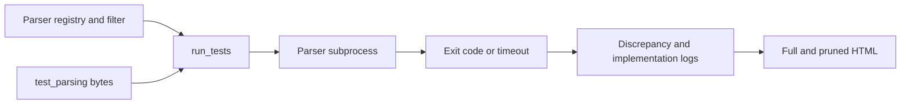

# Initial project assessment

Assessment date: **2026-10-02**. Local baseline:
`1ef36fa01286573e846ac449e8683f8833c5b26a` (merge of upstream PR #139).
The public GitHub API reported the same SHA for upstream `master` during this
assessment. The initial working tree was clean and `origin` pointed to
`https://github.com/Prodigysec/JSONTestSuite.git`; no `upstream` remote was configured.

This first phase establishes documentation, architecture, and a review queue.
It does not integrate the pending PRs or change parser/runner behavior. The
upstream inventory below is an initial triage of open item titles and bodies,
with selected local-code checks, not a completed review of every discussion,
patch, or closed item. Refresh it before implementation.

## What is here

| Component | Baseline | Role |
| --- | --- | --- |
| `test_parsing/` | 318 files: 95 `y_`, 188 `n_`, 35 `i_` | Byte-level acceptance/rejection inputs. |
| `test_transform/` | 22 files | Inputs exposing differences in parsed values or serialization. |
| `programs` in `run_tests.py` | 94 distinct entries (95 definitions, one repeated key) | Commands for specific parsers, versions, and modes. |
| `parsers/` | Mixed source, wrappers, build projects, and binaries | Connects parser APIs to a process exit-code protocol. |
| `results/` | Logs, two parsing reports, transformation report, CSS, image | Historical output plus the default destination for new runs. |
| `article/parsing_json.md` | Original article source | Context and historical interpretation of results. |

The corpus is independently useful to downstream parser projects. The runner
and adapter collection are a separate portability and reproducibility problem:
some commands assume old interpreter versions, fixed installation paths, or
macOS binaries. Ninety-four configurations do not mean ninety-four distinct
libraries or ninety-four runnable installations on a given host.

## Execution and reporting architecture

1. CLI parsing accepts an optional fixture selector and a JSON filter file.
2. `run_tests()` opens `results/logs.txt` in overwrite mode, sorts parser names,
   filters them, and optionally runs each entry's setup command.
3. It walks `test_parsing/` for `.json` files. A selector matches the basename of
   a corpus file; it does not substitute an external input file.
4. It starts a subprocess for each parser/fixture pair, passing a filename or
   supplying bytes on stdin. Parser output is discarded and execution is
   limited to five seconds. Execution is sequential.
5. Exit status is compared with the filename prefix. Only unexpected `y_`/`n_`
   results, all `i_` outcomes, crashes, and timeouts are logged.
6. Report functions read all `.txt` files in `results/`, group cases by their
   logged outcomes, and write full and pruned HTML reports. A missing outcome
   is rendered as an expected result when another parser logged that case.

There is no current transformation runner, aggregate CI verdict, runtime version
inventory, or repository-wide build/installation system. Adapter subprojects
can contain their own tests and build scripts.

## Findings from the local code

These findings describe the initial baseline. See
[implementation progress](#implementation-progress) for subsequent fixes.

| Priority | Finding and evidence | Consequence / next action |
| --- | --- | --- |
| High | `run_tests()` uses `result == "FAIL"` in the exit-1 branch. | This comparison leaves `result` as `None`. Later checks happen to classify ordinary rejection correctly, but the internal result is wrong. Fix with regression coverage. |
| High | The timeout handler prints `result` before the assignment later in the loop. | A timeout on the first executed case can raise `UnboundLocalError`; later timeouts can print a previous result. Fix and exercise a first-case timeout. |
| High | Successful `y_`/`n_` cases and explicit skips are absent from logs. | Reports cannot establish complete execution; absent cells can conflate expected and unexecuted cases. Track explicit outcomes and planned/executed/skipped totals; relates to #131. |
| High | Setup uses `subprocess.call()` without checking its return code; parser stderr is discarded. | Build and dependency failures can look like parser behavior. Separate setup failure, unavailable adapters, JSON rejection, crash, and timeout. |
| High | `parsers/test_json.rb` treats a successfully parsed `nil` as rejection. | Valid top-level JSON `null` is rejected by the wrapper. Review PR #145 and test on an available Ruby runtime. |
| Medium | Empty filters are falsey and mean all parsers; unknown names or fixture selectors are not validated. | Typos can silently run nothing, while `[]` runs everything. Define and test explicit selection semantics. |
| Medium | Reports ingest every `.txt` file in their output directory. | Old or unrelated data can be combined with a new run. Isolate each run and define an explicit report input. |
| Medium | `f_underline_non_printable_bytes()` inserts printable fixture characters into HTML without escaping them. | Displayed input can be interpreted as markup. Escape fixture text and parser labels while preserving intentional report formatting. |
| Medium | The runner does not return an aggregate failure code for discrepancies. | CI cannot use process success as a test verdict. Define a documented exit policy. |
| Medium | Executable paths and version labels are hard-coded; many binaries/toolchains are historical. | Add reproducible builds, availability checks, actual version metadata, and platform-aware configuration. |
| Low | The registry defines `C++ nlohmann JSON 20190718` twice. | Python retains only the latter dictionary entry. Remove the duplicate and detect repeated registry names in future validation. |
| Medium | `test_transform/` is not executed by `run_tests.py`. | Numeric precision, duplicate keys, and value preservation need a separate result contract and runner. |

Byte-for-byte comparison found two duplicate pairs in the root parsing corpus:

- `y_number_minus_zero.json` and `y_number_negative_zero.json` (PR #126).
- `n_structure_U+2060_word_joined.json` and
  `n_structure_whitespace_U+2060_word_joiner.json`.

Do not remove these automatically: downstream projects may refer to the names,
and historical results also use filenames as identifiers. The nested CCAN test
copies mentioned in issues #92 and #94 need a separate audit.

## Standards and coverage decisions

Use [RFC 8259](https://www.rfc-editor.org/rfc/rfc8259.html) as the primary reference.
Important distinctions for future changes are:

- Section 2 defines a single JSON text and its permitted surrounding whitespace.
  A stream of multiple texts is a separate input mode.
- Sections 6 and 9 permit implementation limits, including numeric range and
  precision. Syntactic validity and exact value preservation are distinct.
- Section 7 defines legal escapes and unescaped characters; escaping does not
  permit arbitrary backslash sequences.
- Section 8 discusses encoding and Unicode interoperability. Malformed-byte
  fixtures are intentional data, not files to repair by transcoding.
- Section 9 permits extensions. Acceptance of an `n_` fixture can identify an
  enabled extension; record that mode when interpreting results.

The fork should retain compatibility with the existing corpus while developing
explicit metadata for syntax, limits, modes, and transformations. Any changed
classification needs a documented rationale and an impact review.

## Upstream review queue

The [open issues](https://github.com/nst/JSONTestSuite/issues) and
[open PRs](https://github.com/nst/JSONTestSuite/pulls) were checked through the
public GitHub API: **39 issues and 14 PRs**. At that initial check, all listed PRs
were pending local diff review and integration; subsequent dispositions are
recorded below and in implementation progress. Suggested review order is based on scope and
dependencies, not an assertion that a proposal is ready to merge.

### Open pull requests

| PR | Proposed change | Initial review focus |
| --- | --- | --- |
| [#146](https://github.com/nst/JSONTestSuite/pull/146) | Reject trailing nonbreaking space | Reviewed and applied locally with exact upstream bytes; see implementation progress. Upstream remains open. |
| [#137](https://github.com/nst/JSONTestSuite/pull/137) | Add an octal-escape negative test | Reviewed and applied locally for #136 with exact upstream bytes; see implementation progress. Both upstream items remain open. |
| [#105](https://github.com/nst/JSONTestSuite/pull/105) | Add leading-zero negative tests | Integrated four exact fixtures for #104; see [batch review](review-batch-105-113-126.md). |
| [#145](https://github.com/nst/JSONTestSuite/pull/145) | Fix Ruby wrapper | Reviewed and applied locally; see implementation progress below. Tested with Ruby 3.2.3 / JSON 2.6.3; upstream remains open. |
| [#113](https://github.com/nst/JSONTestSuite/pull/113) | Correct executable flags | Integrated with adaptations for current paths and debug-symbol files; see [batch review](review-batch-105-113-126.md). |
| [#126](https://github.com/nst/JSONTestSuite/pull/126) | Delete a duplicate minus-zero fixture | Reviewed; deletion declined locally to preserve names used by historical reports and consumers. See [batch review](review-batch-105-113-126.md). |
| [#128](https://github.com/nst/JSONTestSuite/pull/128) | Update Newtonsoft.Json 12.0.3 to 13.0.2 | Adapted, built, and run against all 324 fixtures locally. See [batch review](review-batch-128-147-143.md). |
| [#147](https://github.com/nst/JSONTestSuite/pull/147) | Add JSONpp | Adapted into a pinned source build and run against all 324 fixtures locally. See [batch review](review-batch-128-147-143.md). |
| [#143](https://github.com/nst/JSONTestSuite/pull/143) | Add opack | Adapted into a pinned source build and run against all 324 fixtures locally. See [batch review](review-batch-128-147-143.md). |
| [#142](https://github.com/nst/JSONTestSuite/pull/142) | Add fastjson2 2.0.53 | Adapted with a verified dependency and tested against 324 fixtures; native extensions and crashes documented in [batch review](review-batch-142-133-124.md). |
| [#133](https://github.com/nst/JSONTestSuite/pull/133) | Add jsoncgx | Adapted with pinned source and explicit comment modes; both modes tested against 324 fixtures. See [batch review](review-batch-142-133-124.md). |
| [#124](https://github.com/nst/JSONTestSuite/pull/124) | Add clojure.data.json | Adapted two versioned wrappers with whole-input checks; both surveyed against 324 fixtures. See [batch review](review-batch-142-133-124.md). |
| [#107](https://github.com/nst/JSONTestSuite/pull/107) | Add RubyLane's Tcl parser | Adapted to pinned rl_json v0.17.6 with strict UTF-8 and comment-free validation; see [batch review](review-batch-107-103-141.md). |
| [#103](https://github.com/nst/JSONTestSuite/pull/103) | Add libfyaml JSON mode | Adapted to pinned libfyaml v0.9.6 and its `fy-tool` JSON streaming mode; see [batch review](review-batch-107-103-141.md). |

### Open issues

Every open issue is accounted for below. Grouping is a work-planning aid;
linked discussions and historical fixes still need review before disposition.

| Area | Issues | Initial disposition |
| --- | --- | --- |
| Runner and reports | [#141](https://github.com/nst/JSONTestSuite/issues/141), [#131](https://github.com/nst/JSONTestSuite/issues/131), [#82](https://github.com/nst/JSONTestSuite/issues/82), [#48](https://github.com/nst/JSONTestSuite/issues/48) | #141 parser-level concurrency is integrated; see [parallel review](review-batch-107-103-141.md). #131 expected rows and #82 active CLI were verified; #48 path selection now targets one nested fixture exactly while preserving bare-name matching. See [runner review](review-batch-131-82-48.md). |
| Builds and distribution | [#140](https://github.com/nst/JSONTestSuite/issues/140), [#87](https://github.com/nst/JSONTestSuite/issues/87), [#81](https://github.com/nst/JSONTestSuite/issues/81), [#41](https://github.com/nst/JSONTestSuite/issues/41) | #140 now has Makefile builds for three checked-in C sources; #87's earlier PR #113 fix was verified; #81 has a corpus-only archive and sparse-checkout instructions, while a separate repository was not created. #41 retains separate scope. See [batch review](review-batch-140-87-81.md). |
| Missing syntax cases and duplicates | [#136](https://github.com/nst/JSONTestSuite/issues/136), [#104](https://github.com/nst/JSONTestSuite/issues/104), [#92](https://github.com/nst/JSONTestSuite/issues/92) | #136's octal fixture was integrated earlier and its exact bytes reverified in the [VHDL/picojson review](review-batch-23-21-136.md). #92's duplicate is confined to generated CCAN vendor cases; both retained. See [CCAN review](review-batch-92-94-93.md). |
| Standards and classification | [#149](https://github.com/nst/JSONTestSuite/issues/149), [#119](https://github.com/nst/JSONTestSuite/issues/119), [#118](https://github.com/nst/JSONTestSuite/issues/118), [#112](https://github.com/nst/JSONTestSuite/issues/112), [#94](https://github.com/nst/JSONTestSuite/issues/94), [#93](https://github.com/nst/JSONTestSuite/issues/93), [#91](https://github.com/nst/JSONTestSuite/issues/91), [#85](https://github.com/nst/JSONTestSuite/issues/85), [#77](https://github.com/nst/JSONTestSuite/issues/77) | #77's RFC 8259 encoding/BOM wording and current fixture names were corrected in the article; no corpus reclassification was needed. See [RFC/transform review](review-batch-77-76-71.md). Earlier standards items are covered in the [escape/stream/encoding review](review-batch-112-91-85.md), [numeric/NUL/DEL review](review-batch-149-119-118.md), and [CCAN/extension review](review-batch-92-94-93.md). |
| Adapter/runtime updates | [#114](https://github.com/nst/JSONTestSuite/issues/114), [#111](https://github.com/nst/JSONTestSuite/issues/111), [#83](https://github.com/nst/JSONTestSuite/issues/83), [#39](https://github.com/nst/JSONTestSuite/issues/39), [#25](https://github.com/nst/JSONTestSuite/issues/25) | #39/#25 now have a runnable jq whole-input mode and a fresh 327-case local result survey; #83 now has an explicit Node.js/V8 strict-UTF-8 mode, while additional browser engines remain pending. See the [runtime review](review-batch-39-25-83.md). Rust and PHP updates remain pending. |
| Additional parser coverage | [#97](https://github.com/nst/JSONTestSuite/issues/97), [#95](https://github.com/nst/JSONTestSuite/issues/95), [#70](https://github.com/nst/JSONTestSuite/issues/70), [#62](https://github.com/nst/JSONTestSuite/issues/62), [#42](https://github.com/nst/JSONTestSuite/issues/42), [#40](https://github.com/nst/JSONTestSuite/issues/40), [#23](https://github.com/nst/JSONTestSuite/issues/23), [#21](https://github.com/nst/JSONTestSuite/issues/21) | #97 amjson, #42 C YAJL, and #70 SQLite JSON1 have a [batch review](review-batch-97-42-70.md). #95 simdjson, #62 PostgreSQL JSONB, and #40 Linux Swift Foundation have a [batch review](review-batch-95-62-40.md). #23 VHDL and #21 picojson now have modes and a [batch review](review-batch-23-21-136.md); further C++ parsers named in #21 remain pending. |
| Transformation semantics | [#76](https://github.com/nst/JSONTestSuite/issues/76), [#71](https://github.com/nst/JSONTestSuite/issues/71) | Four signed-zero and case-distinct-key inputs were added to `test_transform/` and directly inspected with Python and Perl. A general transformation runner remains pending. See [batch review](review-batch-77-76-71.md). |
| Article maintenance | [#148](https://github.com/nst/JSONTestSuite/issues/148), [#134](https://github.com/nst/JSONTestSuite/issues/134), [#75](https://github.com/nst/JSONTestSuite/issues/75) | #148's pre-ES2019 JavaScript claim is now dated; #134's prior typo and escape fixes were verified, with two further examples corrected; #75's stale invalid-UTF-8 filename and surrogate explanation were updated. See the [article review](review-batch-148-134-75.md). |
| No implementation request | [#106](https://github.com/nst/JSONTestSuite/issues/106) | Acknowledgment; no code change indicated. |

### Suggested implementation sequence

1. **Make execution trustworthy.** Fix rejection/timeout handling, test selection,
   setup failures, report escaping, and explicit outcome accounting. Add focused
   regression tests and a useful CI exit policy.
2. **Integrate small corpus and adapter fixes.** Review PRs #146, #137, #105,
   and #145 with their issue links; then assess mode cleanup and duplicates.
3. **Make builds reproducible.** Document dependencies and platform constraints,
   detect versions, and separate unavailable adapters from failed parses.
4. **Expand parser coverage.** Review dependency and new-parser PRs one at a time,
   preserving authorship and recording actual tested environments.
5. **Broaden assertions.** Add standards/coverage metadata, transformations,
   extension profiles, and parser/version/platform coverage tracking. Introduce
   concurrency after result handling is deterministic and tested.

Each integration should record its source issue/PR, reviewed revision, local
commit when available, validation results, and any remaining limitation. Closing
an item upstream is separate from implementing its resolution in this fork.

## Baseline validation

Validation used a temporary copy of the runner, root parsing corpus, Perl
adapter, and CSS so checked-in reports and fixtures were preserved.

- Perl **5.38.2**, JSON::PP **4.16**: all **318** fixtures were invoked.
- All **95** `y_` fixtures were accepted and all **188** `n_` fixtures rejected.
- The **35** `i_` cases produced **15** `IMPLEMENTATION_PASS` and **20**
  `IMPLEMENTATION_FAIL` entries. There were no crash or timeout entries.
- Both full and pruned reports were generated. A separate run selecting
  `y_array_empty.json` invoked exactly one case and completed successfully.
- The README's Python acceptance/rejection examples returned `0` and `1`
  respectively; the registry-listing and CLI help commands were checked.
- A controlled `subprocess.TimeoutExpired` mock on the first selected case
  reproduced `UnboundLocalError` in the timeout handler, using a temporary log.
- Relative documentation links, links covering all 53 open upstream items,
  and documentation whitespace were checked.

This establishes one working baseline adapter, not validation of the remaining
93 configurations. It also demonstrates why a report containing only the 35
implementation-dependent cases does not describe all 318 executions.

## Implementation progress

### 2026-10-02: rejection, timeout, and resource handling

The initial documentation was committed as `2a3ba8a`. The following runner
changes address defects found during local inspection; they do not integrate an
upstream PR or resolve the separate reporting issue #131.

- Corrected the exit-1 assignment so the internal result is `FAIL`.
- Removed the timeout handler's dependency on an unset or previous result. It
  now logs and prints `TIMEOUT` and continues execution.
- Closed fixture stdin streams on normal return, timeout, missing/invalid
  executable, and unexpected subprocess errors. The output sink and log now
  use context managers so they close even when an exception propagates.
- Added six standard-library regression tests under `tests/test_runner.py`.
  Before the fix, they reproduced the first-timeout exception, stale timeout
  diagnostic, and unclosed streams. All six pass with the changes, including
  the acceptance/rejection/crash matrix and POSIX signal termination.

Validation: `python3 -B -m unittest discover -s tests -v`; a separate temporary
copy ran all 318 fixtures with Perl 5.38.2 / JSON::PP 4.16 and generated both
reports. All 95 `y_` and 188 `n_` cases matched expectations; the 35 `i_` cases
retained the baseline 15 acceptances and 20 rejections. Validation ran on Linux
x86_64 with Python 3.12.3. Corpus bytes and historical reports were preserved.

Next runner work: explicit outcome accounting and report correctness (#131),
selection validation, setup-failure handling, HTML escaping, and a documented
CI exit policy. The existing discrepancy-only log format, selection semantics,
and five-second parser timeout remain in effect.

### 2026-10-02: explicit outcomes and issue #131

Reviewed [upstream issue #131](https://github.com/nst/JSONTestSuite/issues/131)
and its comments on 2026-10-02 (no comments). Implementation began from local
commit `57b3d49`. This is a local fix for the issue, not an upstream PR import;
the upstream issue remains open.

- Every selected parser/fixture pair in a completed run now has a three-column
  log record. `EXPECTED_RESULT` records successful `y_`/`n_` cases;
  `SKIPPED_UNAVAILABLE` records cases a parser could not start; and
  `SKIPPED_SETUP_FAILED` records cases omitted after unsuccessful setup.
- A failed setup command is checked before executing the parser. Missing,
  incompatible, or non-executable programs cause their remaining cases to be
  recorded as skipped without repeated launch attempts. Already executed cases
  retain their original results.
- Both reports show explicit expected outcomes, skips, and per-parser recorded
  execution/skip counts. Pruning does not reduce these summary counts. Missing
  historical records appear as `NOT_RECORDED`, not inferred successes.
- The reader accepts historical three-column logs but only reads `logs.txt`,
  rather than merging every text file in the results directory. Parser names
  absent from today's registry and records for removed fixtures remain visible.
- Report text is HTML-escaped, including fixture previews and parser labels.
  Nested fixtures retain distinct relative paths in the log.

Validation: 17 regression tests pass, including successful-case visibility,
missing executables, setup failures, partially executed parsers, filtered runs,
legacy unknown outcomes, full/pruned counts, and raw-byte stdin. The actual
checked-in historical log was also rendered successfully in a temporary output
file, without inferring any expected results.

A fresh temporary run with Perl 5.38.2 / JSON::PP 4.16 recorded **318** outcomes:
**283** expected results, **15** implementation-dependent acceptances, and **20**
implementation-dependent rejections. The full comparison table contains all
318 fixtures; both reports show 318 recorded executions and zero skips or
missing records. Fixture bytes and historical log/HTML artifacts were preserved;
the report stylesheet gained skip and unknown-state styles.

Compatibility limits: old logs cannot reveal completely omitted cases, and new
status values require updates to strict external consumers. Invalid log records
now raise an error. Runtime-launched wrappers can still report dependency errors
as rejection/crash; unavailable dependencies inside a running wrapper cannot be
identified from its exit code alone. Filter validation and an aggregate CI exit
policy remain future work. Interrupted runs are not represented as complete
execution merely because a report can be generated.

### 2026-10-02: selection validation before execution

Starting from local commit `e890aea`, inspection confirmed that empty filters
selected all parsers, unknown parser names were silently ignored, and unmatched
fixture selectors could overwrite the log with no outcomes. This local change
addresses the selection finding above; it does not integrate an upstream PR.

- Filters now require a non-empty JSON array of strings, with every name present
  in the registry. Malformed JSON and unknown names produce clear CLI errors.
  Omitting the filter still selects all parsers; repeated names execute once.
- Unmatched fixture selectors, an empty corpus, and an empty parser registry
  are errors. Existing basename matching remains: a path selector selects all
  corpus fixtures with that basename, including matches in subdirectories.
- Validation completes before setup commands run or the log is opened. The CLI
  exits with status `2` on selection errors without generating reports, keeping
  existing log and HTML bytes intact. Direct `run_tests()` callers receive
  `SelectionError`, a `ValueError` subclass.
- Added regression coverage for malformed and empty filters, incorrect JSON
  types, unknown/mixed parser names, unmatched selectors, empty inventories,
  preservation of existing outputs, and valid selections with duplicate names.

Validation: all **21** regression tests pass. A temporary copy exercised the CLI
with Perl **5.38.2** / JSON::PP **4.16** on Linux x86_64, Python **3.12.3**:
all **318** fixtures produced distinct records, with **283** expected results,
**15** implementation-dependent acceptances, and **20** implementation-dependent
rejections. Both reports show 318 executions, zero skips, and zero missing
records. Tracked fixtures and historical reports were preserved.

Compatibility: callers that previously used `[]` to mean all parsers must omit
the filter instead. Invalid selections now fail instead of silently running a
subset or nothing. The CLI's aggregate pass/fail policy for executed tests
remains future work; status `2` here identifies invalid selection, not parser
discrepancies. External-file selection is still unsupported.

### 2026-10-02: Ruby null handling, PR #145

Refreshed [PR #145](https://github.com/nst/JSONTestSuite/pull/145), its patch,
issue comments, review comments, and reviews (all discussion/review lists empty).
The PR remains open. Reviewed upstream base
`1ef36fa01286573e846ac449e8683f8833c5b26a` and head
`c1126847737c02a842f9767ba6a5823813b7e618`; local work started at `d303267`.

Applied Jean Boussier's (`byroot`) adapter patch without substantive changes:
successful `JSON.parse` now exits `0` regardless of the returned value, and the
legacy `quirks_mode` option and parsed-value debug print are removed. Parse
exceptions still exit `1`. This is a working-tree integration with attribution,
not an upstream merge or a cherry-picked commit. Added adapter documentation and
three regression tests locally; no fixtures, dependencies, or license notices
were changed.

Before editing the adapter, the new regression tests reproduced rejection of
the four bytes `6e 75 6c 6c` (`null`); all other focused cases passed.
[RFC 8259 section 2](https://www.rfc-editor.org/rfc/rfc8259.html#section-2)
permits a value as the entire JSON text, and
[section 3](https://www.rfc-editor.org/rfc/rfc8259.html#section-3) includes `null`.
The existing `y_structure_lonely_null.json` already covers this case, so no
duplicate corpus fixture was added.

Validation used an isolated Ruby **3.2.3** / JSON **2.6.3** runtime on Linux
x86_64 with Python **3.12.3** (see [adapter notes](ruby-adapter.md) for package
versions and invocation). All **24** regression tests pass with Ruby available.
Tests bound each invocation to five seconds and cover scalars, containers,
invalid syntax, trailing data, malformed bytes, and implementation-dependent
inputs. Without Ruby, the three adapter tests explicitly skip.

Before/after full-corpus runs used temporary copies of the runner and the **318**
fixtures at `d303267`. Each run logged all 318 distinct pairs; both full and
pruned reports showed 318 executions, zero skips, and zero missing records.
No crashes or timeouts occurred. The sole outcome change was
`y_structure_lonely_null.json`: `SHOULD_HAVE_PASSED` became `EXPECTED_RESULT`.
After the fix, the counts were **275** expected results, **25** implementation-
dependent acceptances, **10** implementation-dependent rejections, and **8**
unexpected acceptances, all unchanged from baseline except the null result.

The eight remaining `SHOULD_HAVE_FAILED` cases are:

- `n_object_trailing_comment.json`
- `n_string_escape_x.json`
- `n_string_escaped_emoji.json`
- `n_string_incomplete_surrogate_escape_invalid.json`
- `n_string_invalid_backslash_esc.json`
- `n_string_invalid_utf8_after_escape.json`
- `n_string_unicode_CapitalU.json`
- `n_structure_object_with_comment.json`

These are observed behavior of the tested default parser configuration, not
resolved by this wrapper fix. Other Ruby versions, platforms, and the separate
`Ruby regex` adapter remain untested. Historical reports were preserved.
Unhandled runtime/dependency/file errors still need a separate adapter-contract
audit because Ruby can exit `1` for those failures too.

### 2026-10-02: trailing nonbreaking space, PR #146

Reviewed [PR #146](https://github.com/nst/JSONTestSuite/pull/146), its patch,
comments, review comments, and reviews (all PR discussion/review lists empty).
Upstream base: `1ef36fa01286573e846ac449e8683f8833c5b26a`; head:
`7a779d6a7b65d54155bc9741c22d1db4a785ffb2`. The PR remains open.
The linked [jsonriver issue #36](https://github.com/rictic/jsonriver/issues/36)
and its comment describe overly broad trailing-whitespace trimming, attribute
the report to `alexyorke`, and report a fix in jsonriver 1.0.2. Jsonriver was not
installed or independently retested here; this change fills a corpus gap.

Applied `rictic`'s fixture without adaptation as
`test_parsing/n_structure_trailing_invalid_whitespace.json`: exactly three bytes
`31 c2 a0` (ASCII `1` followed by UTF-8 U+00A0), with **no final newline**.
The Git blob hash matches upstream: `dcf4a614b36a275eacf7609735bbcd170d68cca9`.
This is a working-tree integration with attribution, not an upstream merge or
cherry-picked commit. Local HEAD remains `d303267`; the prior Ruby work was
preserved.

Expectation: [RFC 8259 section 2](https://www.rfc-editor.org/rfc/rfc8259.html#section-2)
defines `JSON-text = ws value ws` and restricts whitespace to U+0020, U+0009,
U+000A, and U+000D. U+00A0 is excluded, making this a syntax rejection case,
not an implementation-limit or Unicode-interoperability case. Section 9 permits
parser extensions, so an extension mode might accept it, but that does not
change its `n_` classification under the JSON grammar.

Before adding it, a byte-level audit found no identical fixture and no literal
UTF-8 NBSP bytes in the root corpus. `y_string_nbsp_uescaped.json` contains a
legal escaped NBSP inside a string; the two U+2060 word-joiner cases and the
form-feed whitespace case test different characters inside arrays. None tests
a trailing NBSP after a complete scalar. Existing names and bytes were kept;
the sole corpus change is the new fixture. Current totals are **319** fixtures:
**95** `y_`, **189** `n_`, and **35** `i_`.

Validation used a temporary copy of the current runner and corpus (`d303267`
plus this fixture), on Linux x86_64 / Python 3.12.3 with Perl **5.38.2** and
JSON::PP **4.16**, using the existing adapter's options. All **319** distinct
cases executed: **284** expected results, **15** implementation-dependent
acceptances, and **20** implementation-dependent rejections, with zero crashes,
timeouts, skips, or missing records. Full and pruned reports were generated and
included the new fixture. Temporary controls confirmed acceptance of `31` and
`31 20 09 0d 0a`, and rejection of `31 c2 a0`, with a five-second timeout per
invocation. Tracked reports were preserved. These measurements validate one
parser configuration, not universal parser behavior or complete RFC compliance.

### 2026-10-02: octal escape, PR #137 / issue #136

The preceding Ruby and trailing-NBSP integrations were committed together as
`d6e668d`, with co-author attribution to Jean Boussier and `rictic`.

Refreshed [PR #137](https://github.com/nst/JSONTestSuite/pull/137) and
[issue #136](https://github.com/nst/JSONTestSuite/issues/136), their comments,
the PR review comments, reviews, and patch. All discussion/review lists were
empty; both items remain open upstream. Reviewed API-reported base
`c2011ba75905d2b36baccd60e4c364e785c29885` and head
`91df0e5a8cadcf95ae5be96eed5b2c4a4fb47218`; local baseline was `d6e668d`.

Applied Simon McVittie's (`smcv`) fixture unchanged as
`test_parsing/n_string_octal_escape.json`. Its nine bytes are
`5b 22 5c 30 31 32 22 5d 0a`: `["\012"]` followed by a final LF. The backslash
and the three ASCII digits are literal bytes, not a decoded newline inside
the string. Its Git blob hash matches upstream:
`f18a5b57695d97ff650e51f4a09b5332baf686d6`. This is a working-tree integration
with attribution, not an upstream merge or a cherry-picked commit.

[RFC 8259 section 7](https://www.rfc-editor.org/rfc/rfc8259.html#section-7)
enumerates string escapes: the character after a backslash must be a quotation
mark, backslash, slash, `b`, `f`, `n`, `r`, `t`, or `u` followed by four hex
digits. ASCII `0` is not allowed there. Thus `\012` is a syntax error (`n_`),
not an implementation limit or Unicode-interoperability case. Section 9 allows
extensions; acceptance in an extension mode does not make this standard JSON.
The PR mentions json-glib's extension behavior, which was not tested here.

Before integration, no existing root fixture matched the bytes or contained a
backslash immediately followed by an ASCII octal digit. In particular,
`n_string_backslash_00.json` is `5b 22 5c 00 22 5d`: its byte `00` is a literal
NUL, not the digits `30 31 32`. `n_string_escape_x.json` covers a different
invalid escape, while `y_string_uescaped_newline.json` covers a legal Unicode
escape. Existing fixtures were preserved; this single addition brings the
corpus to **320** cases (**95** `y_`, **190** `n_`, **35** `i_`).

Validation ran all 320 distinct fixtures in a temporary copy of the current
runner and corpus (`d6e668d` plus this fixture), using Perl **5.38.2** / JSON::PP
**4.16** with the existing adapter options on Linux x86_64 / Python **3.12.3**.
Results: **285** expected outcomes, **15** implementation-dependent acceptances,
**20** implementation-dependent rejections, and zero crashes, timeouts, skips,
or missing records. Full and pruned reports both included the new fixture and
counted 320 executions. Temporary controls accepted `["\n"]`, `["\u000a"]`,
and `["\\012"]` (an escaped backslash followed by ordinary digits), while
rejecting the new fixture. Each invocation had a five-second limit. Existing
fixture bytes and tracked historical reports were preserved; validation does
not establish behavior for every parser or extension mode.

### 2026-10-02: parser batch, PRs #128, #147, and #143

The three proposals have been reviewed and adapted locally. Newtonsoft.Json's
package and registry label are updated to 13.0.2; the wrapper now checks a
complete JSON text and rejects malformed UTF-8. JSONpp 0.1.1 and opack 0.2.1
have pinned source builds and registered adapters. The upstream binary artifacts
were not imported. All three adapters compiled, and all 33 regression tests
passed with isolated toolchains. A temporary runner copy recorded all 324
fixtures for each of these adapters and Perl JSON::PP, with no skips or missing
records. The five opack crashes on truncated input and the libraries' unexpected
acceptances remain documented observations. See the
[detailed review](review-batch-128-147-143.md) for revisions, build commands,
tested versions, exact outcomes, and behavioral limits.

### 2026-10-02: parser batch, PRs #142, #133, and #124

fastjson2 2.0.53, jsoncgx 1.1 with comments off/on, and clojure.data.json
1.0.0/2.2.0 are registered with reproducible pinned dependencies. Their
wrappers preserve UTF-8 errors, validate complete input, and distinguish
parse rejection from missing dependencies and unexpected parser failures.
The upstream binaries were omitted. All 50 regression tests passed with
isolated toolchains. A temporary runner recorded all 324 fixtures for fastjson2
and both jsoncgx modes, with no skips or missing rows; both Clojure versions
were surveyed against all fixture bytes in reused JVMs. Full per-invocation
runner timing for Clojure remains unmeasured. See the [detailed review](review-batch-142-133-124.md)
for exact results and known parser limits.

### 2026-10-02: batch of three, PRs #105, #113, and #126

The octal-escape integration was committed as `8520ebc`. The next batch adds
four leading-zero rejection fixtures from Tyler Waters, adapts Mark Conway's
executable-mode cleanup (234 mode-only changes), and records a compatibility
decision to retain both minus-zero fixture names after reviewing PR #126.

See the [full batch review](review-batch-105-113-126.md) for upstream revisions,
attribution, exact fixture bytes, RFC reasoning, mode-change adaptations,
validation, and limitations. All 24 regression tests passed; Perl JSON::PP
executed the expanded 324-case corpus with 289 expected results, 35
implementation-dependent results, and no unexpected outcomes or skips.
All three upstream PRs remain open; local integration and review dispositions
are separate from upstream closure.

### 2026-10-03: issues #92, #94, and #93

Commit `4ea03eb` records the audit of duplicate CCAN vendor cases (#92), adds
the RFC-valid escaped-NUL scalar to the root corpus (#94), and starts a
non-exhaustive machine-readable category for six nonfinite-number extension
candidates (#93). The vendored CCAN tests and strict `n_` expectations remain
unchanged. See the [batch review](review-batch-92-94-93.md) for exact bytes,
upstream discussion, and RFC reasoning. The 325-case corpus ran with Perl
JSON::PP in a temporary runner copy without discrepancies or missing records;
43 regression tests passed and 20 optional-runtime tests were skipped. The
three upstream issues remain open; broader extension classification and report
integration remain separate work.

### 2026-10-03: issues #149, #119, and #118

Commit `f1e6f95` reclassifies four range-sensitive number fixtures from `y_`
to `i_` without changing their bytes, and adds a modest exact
fraction-exponent `y_` case (#149). It retains the literal-NUL rejection and
fixes CCAN's C-string wrapper so NUL cannot hide trailing input; the registered
CCAN adapter now builds from checked-in source (#119). The existing unescaped
DEL acceptance was verified against RFC 8259 section 7 and retained (#118).
See the [batch review](review-batch-149-119-118.md) for fixture-name migration,
adapter provenance, exact bytes, and validation. All 66 tests completed with
47 passes and 19 optional-runtime skips; a temporary runner recorded all 326
fixtures for both CCAN and Perl JSON::PP. CCAN still has three escaped-NUL
rejections and two native parser crashes on deeply nested invalid input. The
three upstream issues remain open; this local disposition does not close them.

### 2026-10-03: issues #112, #91, and #85

Commit `58375ca` retains the invalid uppercase-`U` escape and adds a valid
lowercase-`u` scalar companion (#112), marks two root multiple-text rejection
fixtures in byte-span metadata without changing strict expectations (#91), and
audits the malformed/alternate-encoding corpus bytes without transcoding them
(#85). See the [batch review](review-batch-112-91-85.md) for exact bytes, RFC
reasoning, jq 1.7 stream observations, and limits. A temporary Perl JSON::PP
run recorded all 327 fixtures without discrepancies or missing rows. The 66
repository tests completed with 47 passes and 19 optional-runtime skips. The
three upstream issues remain open; local review does not close them.

### 2026-10-03: issues #77, #76, and #71

Commit `3a56771` corrects the article's RFC 8259 encoding and BOM claims and
its stale UTF-16 fixture reference (#77). It adds four transformation inputs
for signed zero (#76) and case-distinct object names (#71), with direct Python
and Perl value probes documented in the [batch review](review-batch-77-76-71.md).
The 327-case parsing corpus and historical reports are unchanged. The 66
repository tests completed with 47 passes and 19 optional-runtime skips; after
the commit, the corpus archive test also verified committed fixture bytes and
archive reproducibility. Transformation inputs still lack a general runner, so
cross-parser value assertions remain pending. All three upstream issues remain
open; this is a local review and integration disposition.

### 2026-10-03: issues #148, #134, and #75

Commit `d0cc30e` dates the article's pre-ES2019 U+2028/U+2029 comparison
(#148), verifies prior local typo and escape fixes while repairing two more
display examples (#134), and updates the invalid-UTF-8 fixture name and
surrogate explanation (#75). See the [article review](review-batch-148-134-75.md)
for exact bytes, standards links, existing attribution, and limits. Node
24.21.0 confirmed both separator characters in JSON and JavaScript string
literals and retained two high-surrogate code units in the direct parse. The
327-case parsing corpus, runner, and historical reports are unchanged; they
were not rerun for this documentation-only batch. All three upstream issues
remain open; this is a local disposition.

### 2026-10-03: issues #39, #25, and #83

Commit `0d76960` adds a registered jq raw-slurp `fromjson` mode for one
complete JSON text (#39/#25) and a Node.js/V8 `JSON.parse` adapter that
checks UTF-8 bytes before decoding (#83). See the [runtime review](review-batch-39-25-83.md)
for dependencies, exact commands, parser versions, modes, and limits. A
temporary runner copy recorded all 327 fixtures for each entry and generated
both reports without altering historical results. Node.js/V8 had no unexpected
outcomes; jq accepted 24 `n_` number cases as extensions. The full regression
suite completed 72 tests, with 53 passes and 19 optional-runtime skips.
Browser-engine comparisons requested by #83 remain pending. All three issues
remain open upstream; this is a local integration and partial review.

### 2026-10-03: issues #97, #42, and #70

Commit `ab026ac` adds pinned-source amjson and C YAJL adapters and an in-process
SQLite JSON1 adapter. See the [parser review](review-batch-97-42-70.md) for
source revisions, licenses, build commands, modes, and byte-level findings.
Each adapter logged all 327 corpus cases in a temporary runner copy without
skips, crashes, or timeouts. SQLite's literal-NUL truncation was guarded in its
wrapper; YAJL's acceptance of form feed inside an array remains visible as an
unexpected acceptance. All three issues remain open upstream; this is a local
integration and test result, not an upstream disposition.

### 2026-10-03: issues #95, #62, and #40

Commit `8f4ed19` adds simdjson 5.0.1 DOM, PostgreSQL 16 JSONB UTF8, and
Swift Foundation 6.1.3 Linux Docker modes. See the [batch review](review-batch-95-62-40.md)
for source revisions, the closed unmerged PostgreSQL PR #61, pinned builds,
dependencies, parser modes, and exact byte-level findings. Each adapter logged
all 327 fixtures in temporary runner copies with no skips, crashes, or
timeouts. PostgreSQL rejected three valid escaped-NUL texts because JSONB
cannot store U+0000; Linux Foundation accepted three invalid trailing-comma
texts. Historical reports and fixture bytes were unchanged. The upstream
issues remain open; this is a local integration and test result.

### 2026-10-03: issues #23, #21, and #136

Commit `54d7d02` adds pinned-source picojson and JSON-for-VHDL adapters for
the C++ and VHDL coverage requests. The [batch review](review-batch-23-21-136.md)
records their build commands, parser modes, exact bytes, and full 327-case
surveys. picojson accepted 14 malformed numbers and had no crashes; the VHDL
library accepted 55 invalid cases, rejected three valid LF-containing cases,
and caused 12 simulator failures. The previously integrated #136 octal fixture
was reverified against PR #137's Git blob with no duplicate added. Historical
reports and corpus bytes were unchanged. These are local integrations and
review findings; all three upstream issues remain open.
